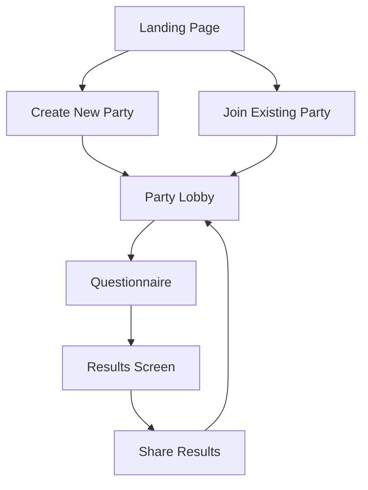
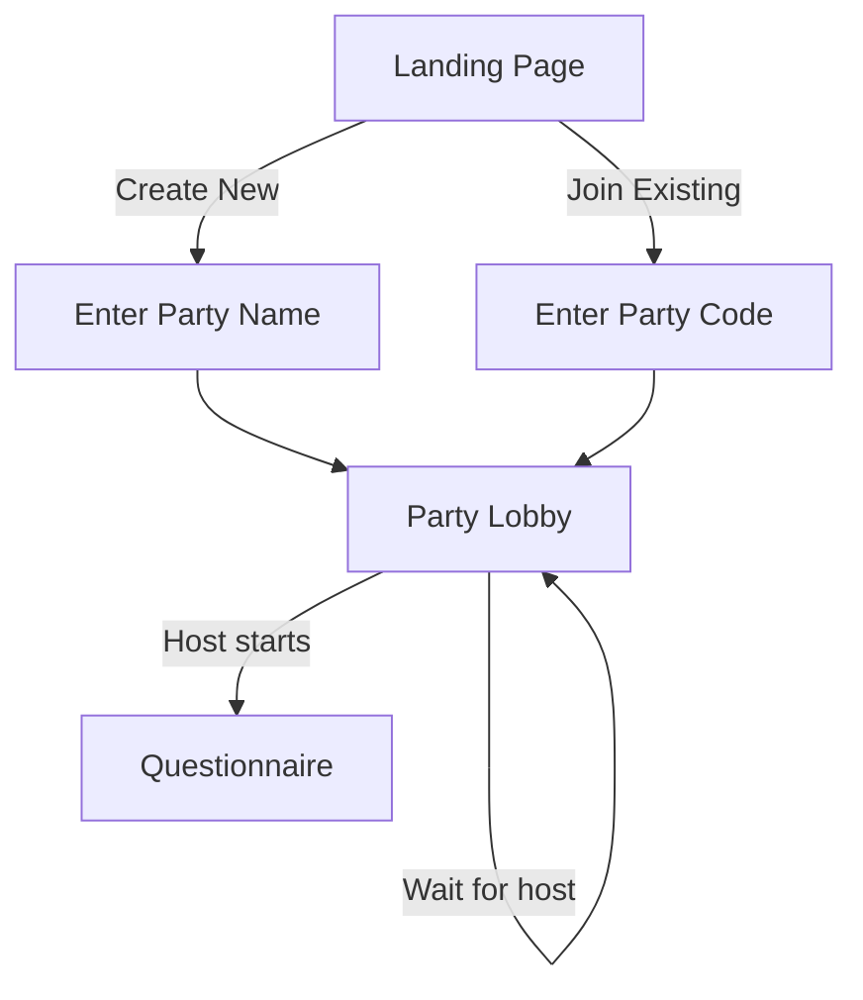
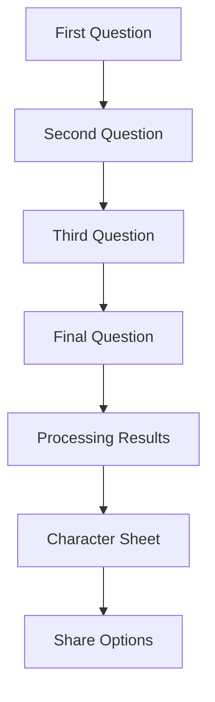

# Friend Party UI/UX Specification

## Introduction

This document defines the user experience goals, information architecture, user flows, and visual design specifications for Friend Party - a social web application that gamifies personality profiling within friend groups using D&D-style stats and classes.

### Overall UX Goals & Principles

#### Target User Personas

1. **The Adventurous Gamer**: D&D enthusiasts who want to bring gaming elements to their social interactions. Tech-savvy and familiar with RPG mechanics.
2. **The Social Coordinator**: Friends who love organizing group activities and want new ways to engage their social circles.
3. **The Casual Participant**: People who enjoy lighthearted social games but may not be familiar with D&D mechanics.

#### Usability Goals

1. **Engaging Onboarding**: New users can create or join a party and start answering questions within 2 minutes
2. **Intuitive Gameplay**: The D&D-inspired mechanics should be immediately understandable even to non-gamers
3. **Social Sharing**: Easy ways to share results and invite friends to join parties
4. **Retro Aesthetic**: The interface should evoke nostalgia for classic D&D materials while remaining modern and accessible

#### Design Principles

1. **D&D Authenticity**: Use visual language and terminology familiar to D&D players
2. **Social Focus**: Prioritize features that encourage group interaction and sharing
3. **Playful Discovery**: Make the process of answering questions feel like an adventure
4. **Nostalgic Modernism**: Combine retro D&D aesthetics with modern web conventions
5. **Accessible Fun**: Ensure the playful design doesn't compromise accessibility

### Information Architecture

#### Site Map / Screen Inventory

#### Navigation Structure

**Primary Navigation**:
- Main navigation is handled through clear CTAs that guide users through the party flow
- Breadcrumbs show progress through the questionnaire
- Party code is always visible for easy sharing

**Secondary Navigation**:
- Character sheet navigation for viewing different stats
- Social sharing options
- Settings/accessibility controls

### User Flows

#### Create and Join Party Flow

**User Goal**: Create a new party or join an existing one to start the personality profiling game

**Entry Points**:
- Landing page (new users)
- Direct link with party code (returning users)

**Success Criteria**:
- User is in a party lobby ready to start the questionnaire
- Clear visual indication of party status (waiting for members, ready to start)

**Edge Cases & Error Handling**:
- Invalid party codes show helpful error messages
- Network issues during party creation show recovery options
- Clear indicators when waiting for other players

#### Questionnaire Flow

**User Goal**: Answer personality questions to determine their D&D-style character profile

**Entry Points**:
- Party lobby when host starts the game
- Resume from where you left off if returning

**Success Criteria**:
- All questions answered
- Character profile generated and displayed
- Option to share results with party

**Edge Cases & Error Handling**:
- Progress is saved if user leaves mid-questionnaire
- Clear indication of current progress through questions
- Option to review and change previous answers

### Wireframes & Mockups

#### Primary Design Files

**Figma Project**: [Friend Party Design System](https://www.figma.com/files/project/123456)

#### Key Screen Layouts

**Landing Page**
- Hero section with "Create Party" and "Join Party" CTAs
- Brief explanation of how Friend Party works
- Retro D&D inspired illustrations

**Party Lobby**
- Party name and code prominently displayed
- List of current members with their chosen avatars
- Host controls for starting the game
- "Copy Invite Link" button

**Questionnaire Screen**
- Current question displayed in a "scroll" style container
- Answer options as "spellbook" style buttons
- Progress indicator showing questions completed
- Character avatar that updates based on answers

**Character Sheet/Results Screen**
- Full character portrait based on class
- Stats displayed in classic D&D style
- Party comparison view
- Social sharing options

### Component Library / Design System

#### Design System Approach

We'll use a custom design system inspired by classic D&D materials with modern web conventions. The system will include:

- Retro-futuristic UI elements
- Parchment-like backgrounds with modern contrast
- D&D inspired typography with excellent readability
- Interactive elements that feel like physical game components

#### Core Components

**Button**
- Primary: Spellbook-style with magical glow on hover
- Secondary: Parchment-style with ink border
- Icon buttons for social actions

**Card**
- Character cards with stat blocks
- Question cards with scroll styling
- Party member cards with avatar frames

**Input Fields**
- Text inputs styled like inscribed stone
- Select dropdowns as magical scrolls
- Toggle switches as levers and dials

### Branding & Style Guide

#### Visual Identity

**Brand Guidelines**: Inspired by classic D&D materials with a modern, accessible twist

#### Color Palette

| Color Type | Hex Code | Usage |
|------------|----------|-------|
| Primary | #8B4513 (SaddleBrown) | Main buttons, headers |
| Secondary | #CD853F (Peru) | Secondary actions, borders |
| Accent | #FFD700 (Gold) | Highlights, special elements |
| Success | #32CD32 (LimeGreen) | Positive feedback |
| Warning | #FFA500 (Orange) | Cautions |
| Error | #8B0000 (DarkRed) | Errors |
| Neutral | #F5F5DC (Beige) | Backgrounds, text |

#### Typography

**Font Families**:
- Primary: "IM Fell English", serif - A classic serif font reminiscent of old books
- Secondary: "MedievalSharp", cursive - For decorative elements
- Monospace: "Courier Prime", monospace - For code-like elements

**Type Scale**:

| Element | Size | Weight | Line Height |
|---------|------|--------|-------------|
| H1 | 2.5rem | 700 | 1.2 |
| H2 | 2rem | 600 | 1.3 |
| H3 | 1.75rem | 500 | 1.4 |
| Body | 1rem | 400 | 1.5 |
| Small | 0.875rem | 400 | 1.6 |

#### Iconography

**Icon Library**: Custom D&D inspired icons for:
- Character classes
- Stats and abilities
- Social actions
- Game mechanics

**Usage Guidelines**:
- Icons should be used consistently with their defined meanings
- Size appropriately for their context
- Maintain proper contrast with backgrounds

#### Spacing & Layout

**Grid System**: 12-column responsive grid with retro-inspired gutters

**Spacing Scale**: Based on multiples of 8px (1rem = 16px) to maintain rhythm

### Accessibility Requirements

#### Compliance Target

**Standard**: WCAG 2.1 AA with aspirations for AAA where possible

#### Key Requirements

**Visual**:
- Color contrast ratios: Minimum 4.5:1 for normal text, 3:1 for large text
- Focus indicators: Gold outline with animated glow for keyboard navigation
- Text sizing: Relative units with user controls

**Interaction**:
- Full keyboard navigation support
- Screen reader compatibility with ARIA labels
- Touch targets: Minimum 48x48px for mobile

**Content**:
- Alternative text for all meaningful images
- Proper heading structure for screen readers
- Clear form labels and instructions

#### Testing Strategy

- Automated accessibility testing with axe-core
- Manual testing with screen readers
- Keyboard-only navigation testing
- Color contrast validation
- User testing with diverse participants

### Responsiveness Strategy

#### Breakpoints

| Breakpoint | Min Width | Max Width | Target Devices |
|------------|----------|-----------|-----------------|
| Mobile | 0px | 767px | Phones |
| Tablet | 768px | 1023px | Tablets, small laptops |
| Desktop | 1024px | 1439px | Laptops, desktops |
| Wide | 1440px | - | Large monitors |

#### Adaptation Patterns

**Layout Changes**:
- Mobile: Stacked elements with collapsible sections
- Tablet: Side-by-side layouts for key components
- Desktop: Expanded views with additional details

**Navigation Changes**:
- Mobile: Bottom navigation bar
- Tablet/Desktop: Side navigation with additional options

**Content Priority**:
- Mobile: Essential information first, details in expandable sections
- Larger screens: More information visible simultaneously

**Interaction Changes**:
- Mobile: Larger touch targets, simplified gestures
- Desktop: More precise hover interactions

### Animation & Micro-interactions

#### Motion Principles

1. Subtle magical effects for interactions
2. Retro-inspired transitions between states
3. Purposeful motion that enhances understanding
4. Performance-conscious animations

#### Key Animations

- **Button Hover**: Gold sparkle effect (Duration: 300ms, Easing: ease-out)
- **Page Transitions**: Parchment unrolling (Duration: 500ms, Easing: ease-in-out)
- **Stat Changes**: Number rolling like dice (Duration: 800ms, Easing: cubic-bezier)
- **Loading Indicators**: Hourglass with sand animation

### Performance Considerations

#### Performance Goals

- Page Load: Under 2 seconds on mobile networks
- Interaction Response: Under 100ms for all UI responses
- Animation FPS: Consistent 60fps on target devices

#### Design Strategies

- Optimize all assets for web delivery
- Implement lazy loading for non-critical resources
- Use CSS animations where possible for better performance
- Limit concurrent animations to prevent jank
- Implement efficient state management for questionnaire progress

### Next Steps

#### Immediate Actions

1. Review this specification with stakeholders
2. Create high-fidelity wireframes in Figma
3. Develop interactive prototype for user testing
4. Prepare for handoff to development team

#### Design Handoff Checklist

- [ ] All user flows documented
- [ ] Component inventory complete
- [ ] Accessibility requirements defined
- [ ] Responsive strategy clear
- [ ] Brand guidelines incorporated
- [ ] Performance goals established

### Checklist Results

[To be completed after validation against UI/UX checklist]